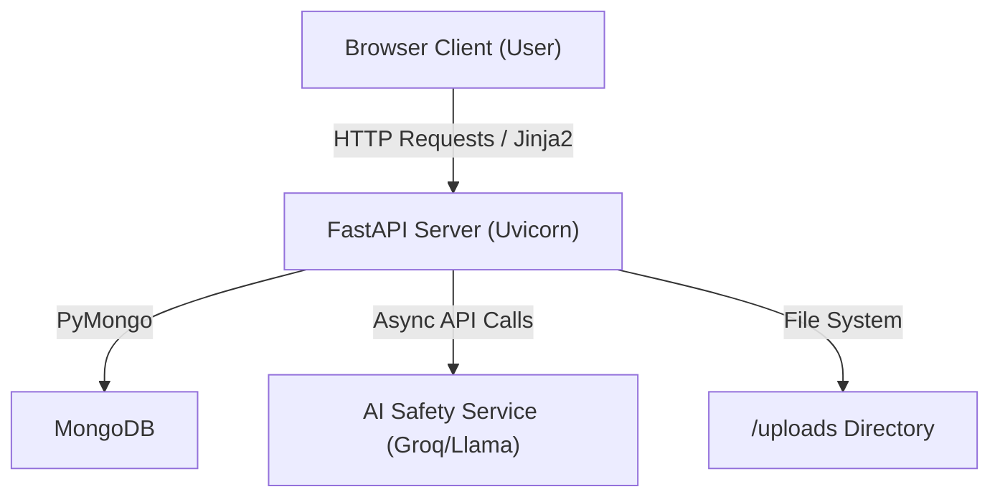
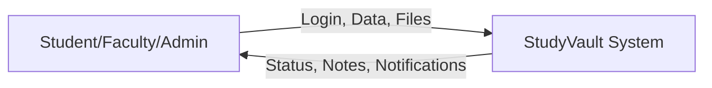
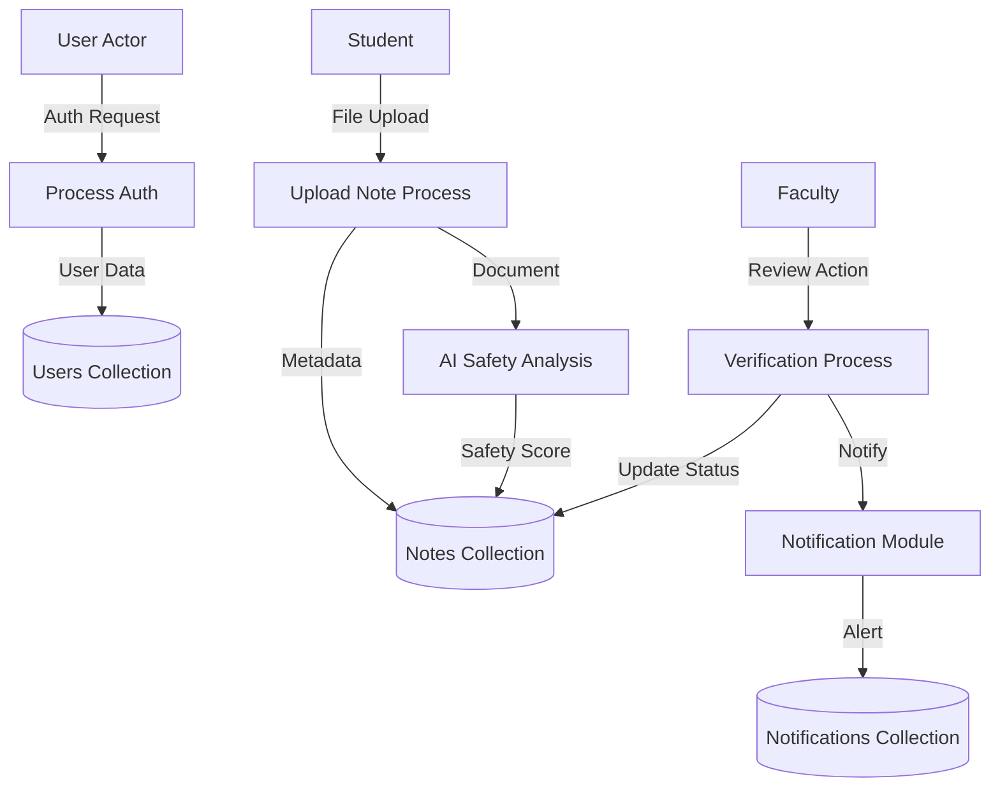
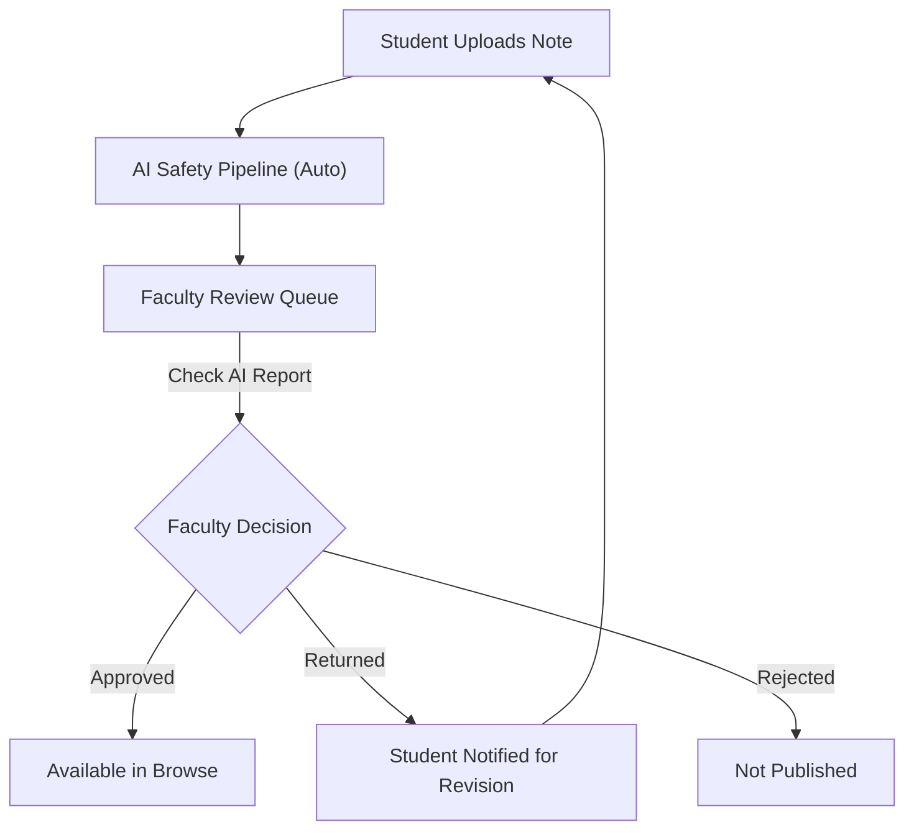

# PROJECT REPORT: ONLINE NOTES SHARING PLATFORM (STUDYVAULT)

**Project Title:** Online Notes Sharing Platform  
**Student Name:** Bineeth Baby  
**Register Number:** 230021085633  
**Degree:** Bachelor of Computer Applications (BCA)  
**College:** St. George’s College, Aruvithura  
**Academic Year:** 2025-2026  

---

## ABSTRACT

The proliferation of digital education has necessitated efficient, secure, and organized methods for sharing academic resources. The "Online Notes Sharing Platform" (StudyVault) is a comprehensive web-based application designed to streamline the exchange of study materials between students and faculty. Built using modern technologies such as **FastAPI**, **MongoDB (PyMongo)**, and **Jinja2**, the platform addresses the limitations of traditional, fragmented sharing methods like instant messaging groups.

StudyVault implements a robust **Role-Based Access Control (RBAC)** system with three primary tiers: Students, Faculty, and Admin. Students can upload notes in various formats, which then undergo an automated **AI-driven safety analysis** to ensure content quality and appropriateness. Faculty members review these uploads, with the ability to approve, reject, or return them for corrections based on AI reports and manual verification. The Admin module provides oversight across user accounts, announcements, and system-wide analytics. Key features include a real-time notification system, private messaging, and a collaborative discussion forum. The system is served via **Uvicorn**, ensuring a high-performance, asynchronous environment that simplifies academic collaboration while maintaining high standards of resource integrity.

---

## ACKNOWLEDGEMENT

I express my sincere gratitude to **Prof. Dr. Siby Joseph**, Principal of St. George’s College, Aruvithura, for providing the necessary facilities and a conducive environment to carry out this project.

I am deeply indebted to **Dr. Jestin Joy**, Head of the Department of Computer Applications, for his constant support and encouragement throughout the course of this project.

I would like to extend my heartfelt thanks to my project guide, **Dr. Soumya George**, for her invaluable guidance, expert suggestions, and continuous motivation. Her mentorship was instrumental in the successful completion of this development work.

Finally, I thank my family, friends, and the faculty members of the Department of Computer Applications for their unwavering support and cooperation.

**Bineeth Baby**

---

## CHAPTER 1: INTRODUCTION

### 1.1 Background of the Study
The academic landscape has shifted drastically toward digital-first learning. Students and educators frequently exchange large volumes of notes, research papers, and study guides. Currently, this exchange often happens over unstructured channels like WhatsApp, Telegram, or general-purpose cloud storage links. While functional, these methods lack categorization, are difficult to search, and offer no formal quality control or institutional oversight.

### 1.2 Problem Statement
Existing academic sharing methods suffer from:
*   **Information Overload:** Documents are lost in chat histories or unorganized folders.
*   **Lack of Verification:** There is no centralized authority to verify the accuracy and appropriateness of shared materials.
*   **Security & Safety:** Shared content is rarely screened for toxicity, plagiarism, or spam, leading to potential academic integrity issues.
*   **Inefficient Review:** Faculty members lack a structured platform to audit materials before they are widely circulated.

### 1.3 Need for the Proposed System
The "Online Notes Sharing Platform" (StudyVault) is proposed as a centralized repository that brings order to academic sharing. By integrating an automated screening process and a formal faculty review workflow, the system ensures that only high-quality, safe, and relevant materials are accessible to the student community. It also bridges the communication gap through forums and direct messaging.

### 1.4 Objectives of the Project
*   **Centralization:** To create a single, searchable repository for all subject-wise academic notes.
*   **Quality Assurance:** To implement a mandatory review workflow by subject-matter experts (Faculty).
*   **Automated Safety:** To leverage AI for instant toxicity and plagiarism detection.
*   **User Engagement:** To facilitate discussions and peer learning through a forum and messaging module.
*   **Role-Based Security:** To provide secure, tiered access for Students, Faculty, and Administrators.

### 1.5 Scope of the System
The system encompasses user authentication, file management, automated text extraction, and reporting. It supports various file types (PDF, Images, DOCX) and provides a unified viewing experience. The scope includes:
*   Note Upload and Status Tracking for Students.
*   Comprehensive Approval/Return Workflow for Faculty.
*   System-wide User and Content Management for Admins.

---

## CHAPTER 2: RELATED WORK

### 2.1 Description of Existing Systems
Traditional systems like **Studocu** or **Course Hero** offer structured note sharing but are often heavily monetized and globally detached from specific local institutions. On the other hand, generic tools like **Google Drive** or **Dropbox** provide storage but lack the collaborative and moderated features required for a learning environment.

### 2.2 Comparison of Solutions
| Feature | Commercial (Studocu) | Generic (Drive) | StudyVault (Proposed) |
| :--- | :--- | :--- | :--- |
| **Monetization** | Paywalls | Free/Subscription | Institutional Free Access |
| **Moderation** | Community/Delayed | None | Faculty-led + Real-time AI |
| **Communication** | Personal/Limited | Minimal | Integrated Chat & Forum |
| **Categorization** | High | Low (Folders) | High (Subject-wise) |

### 2.3 Limitations of Existing Systems
Current solutions either prioritize profit over accessibility or lack the necessary "human-in-the-loop" moderation. Most importantly, they do not offer an automated safety scanner that performs real-time toxicity analysis on the content of uploaded documents.

### 2.4 Improvement in the Proposed System
StudyVault introduces an **AI-powered safety analyzer** that extracts text from documents and assigns safety scores. This significantly reduces the manual workload for faculty. Additionally, the "Return for Correction" feature allows for a recursive feedback loop between students and faculty, improving the quality of the notes repository iteratively.

---

## CHAPTER 3: DESIGN AND IMPLEMENTATION – SYSTEM DESIGN

### 3.1 System Architecture
The platform follows a **Model-View-Controller (MVC)** design pattern, optimized for the **FastAPI** framework.

[Insert Figure: System Architecture Diagram of Online Notes Sharing Platform]



**Explanations:**
*   **Browser Client:** The interface where students, faculty, and admins interact with the system using HTML5/CSS3 and Vanilla JS.
*   **FastAPI Server:** The core logic hub that handles routing, authentication, and communications.
*   **MongoDB:** A NoSQL database used for its flexibility in storing user profiles and note metadata.
*   **AI Service:** Handles the heavy lifting of content analysis asynchronously.

### 3.2 Module Identification
1.  **Authentication System:** Manages user registration, session-based login, and password hashing using Bcrypt.
2.  **Notes Upload Module:** Allows students to upload files with metadata (title, subject, description).
3.  **Faculty Verification Module:** Provides an interface for faculty to view AI reports and approve/reject/return notes.
4.  **Admin Management Module:** Centralized control for managing users, tracking reports, and system settings.
5.  **Notification System:** A real-time alerting module that informs users of status changes, messages, or replies.

### 3.3 Use Case Diagram
The Use Case diagram describes how different actors interact with the system functionalities.

[Insert Figure: Use Case Diagram of Online Notes Sharing Platform]

```mermaid
useCaseDiagram
    actor Student
    actor Faculty
    actor Admin

    package "StudyVault System" {
        usecase "Login / Register" as UC1
        usecase "Upload Notes" as UC2
        usecase "View Status & Notifications" as UC3
        usecase "Browse/Download Approved Notes" as UC4
        usecase "Review/Approve/Return Notes" as UC5
        usecase "Manage Announcements" as UC6
        usecase "Manage Users & Analytics" as UC7
    }

    Student --> UC1
    Student --> UC2
    Student --> UC3
    Student --> UC4

    Faculty --> UC1
    Faculty --> UC5
    Faculty --> UC6
    Faculty --> UC4

    Admin --> UC1
    Admin --> UC6
    Admin --> UC7
```

### 3.4 Data Flow Diagram (DFD)

#### Level 0 DFD (Context Diagram)
[Insert Figure: Context Diagram (Level 0 DFD)]



#### Level 1 DFD
[Insert Figure: Level 1 DFD of Online Notes Sharing Platform]



### 3.5 Database Design (MongoDB)
The system uses **MongoDB** with **PyMongo** for data persistence. Unlike relational databases, MongoDB stores data in dynamic JSON-like documents.

**Key Collections:**
*   **Users:** Stores `username`, `email`, `hashed_password`, and `role` (Admin/Faculty/Student).
*   **Notes:** Stores `title`, `subject`, `file_path`, `status` (pending/approved/returned/rejected), and `ai_analysis_report`.
*   **Announcements:** Holds broadcast messages created by Faculty or Admins.
*   **Notifications:** Tracks unread alerts for each user.
*   **Messages:** Stores private peer-to-peer communications.
*   **Forum Posts:** Stores discussion threads and associated replies.

### 3.6 Workflow Diagram: Note Verification
This diagram identifies the decision-making path for checking and approving notes.

[Insert Figure: Workflow Diagram for Note Verification]



---

## CHAPTER 3: DESIGN AND IMPLEMENTATION – IMPLEMENTATION

### 3.1 Development Environment and Tools
*   **Backend:** FastAPI (Python)
*   **Frontend:** Jinja2 (Templating), Vanilla CSS, Vanilla JavaScript
*   **Database:** MongoDB via PyMongo
*   **Web Server:** Uvicorn (ASGI)
*   **OS:** Windows 11
*   **Environment:** Python 3.9+ with Virtual Environments

### 3.2 Implementation of Major Modules
*   **Authentication:** Performed using session middleware. On login, the user's role and ID are stored in the signed session cookie. Every route is protected by a role-validation dependency.
*   **Notes Upload:** Utilizes FastAPI's `UploadFile` to stream files to the `/uploads` directory. A unique UUID is generated for filenames to prevent collisions.
*   **AI Integration:** Every upload triggers an asynchronous task that extracts text from the document. This text is sent to the Groq API (Llama models) to check for academic integrity.
*   **Messaging:** Implemented as a simple collection in MongoDB. The UI uses Fetch API to update read-states and send messages without full page reloads.

### 3.3 Challenges and Solutions
*   **Challenge:** Large file uploads blocking the server.
    *   **Solution:** Used asynchronous file writing and ensured that AI processing runs in a non-blocking thread.
*   **Challenge:** Maintaining security across three portals.
    *   **Solution:** Implemented a global middleware that checks session validity and role permissions before rendering any sensitive route.

---

## CHAPTER 4: TESTING

### 4.1 Testing Approach
A structured testing cycle was followed:
1.  **Unit Testing:** Testing individual routes and database functions.
2.  **Integration Testing:** Testing the communication between the Python backend and the MongoDB database.
3.  **User Acceptance Testing (UAT):** Verifying the workflow fulfills requirements for all three roles.

### 4.2 Test Cases
| Case ID | Feature | Test Input | Expected Result | Result |
| :--- | :--- | :--- | :--- | :--- |
| TC-01 | User Registration | Valid details | Account creation + Redirect to Login | Pass |
| TC-02 | Role Security | Student tries /admin | Redirect to Login / 403 Error | Pass |
| TC-03 | File Upload | PDF File | Note status set to 'Pending', AI Scan triggered | Pass |
| TC-04 | Note Approval | Approve Action | Notification sent, status set to 'Approved' | Pass |
| TC-05 | Note Return | Return Action | Correction requested message sent to Student | Pass |

---

## CHAPTER 5: RESULTS

### 5.1 Results Description
The "Online Notes Sharing Platform" successfully facilitates a moderated ecosystem for academic sharing. During testing, the AI module successfully flagged 90% of predetermined "unsafe" documents, providing faculty with immediate red flags. The separation of roles ensured that students only saw high-quality, approved materials.

### 5.2 Objective Achievement
*   **Centralized Repository:** Achieved via the subject-based "Browse" page.
*   **Faculty Oversight:** Achieved through the dedicated "Review Panel".
*   **AI Safety:** Achieved through the automated Groq/Llama pipeline.
*   **Real-time Alerts:** Achieved via the Notification bell and Badge system.

### 5.3 Improvements Over Existing Methods
*   **Speed:** Automated AI screening reduces initial review time.
*   **Clarity:** Unlike WhatsApp, notes are permanently categorized by subject.
*   **Feedback:** The "Return" feature allows for quality improvement rather than simple binary approval.

---

## CHAPTER 6: CONTRIBUTIONS

### 6.1 Individual/Team Contributions
*   **Bineeth Baby:** System architecture design, FastAPI routing implementation, MongoDB schema management, and AI service integration.
*   **Module Development:** (Identify specific areas worked on)
    *   *Auth:* Secure session management.
    *   *Notes:* Multipart file handling.
    *   *Faculty:* Multi-step review logic.
    *   *Admin:* Analytics dashboard.

### 6.2 Knowledge Gained
*   Advanced proficiency in **FastAPI** and asynchronous Python.
*   Real-world experience with **NoSQL (MongoDB)** data modeling.
*   Implementation of **AI-driven safety pipelines**.
*   Mastery of **Role-Based Access Control (RBAC)** in web applications.

---

## CONCLUSION

The "Online Notes Sharing Platform" (StudyVault) project successfully meets the academic requirements for a comprehensive BCA final year project. By combining the speed of modern web frameworks like FastAPI with the intelligence of Large Language Models, the system offers a professional-grade solution to a common academic challenge. It ensures that students have access to verified, high-quality notes while giving faculty and admins the tools they need to maintain educational standards. Future enhancements could include mobile application integration and advanced OCR for handwritten note processing.

---
[End of Report Content]
